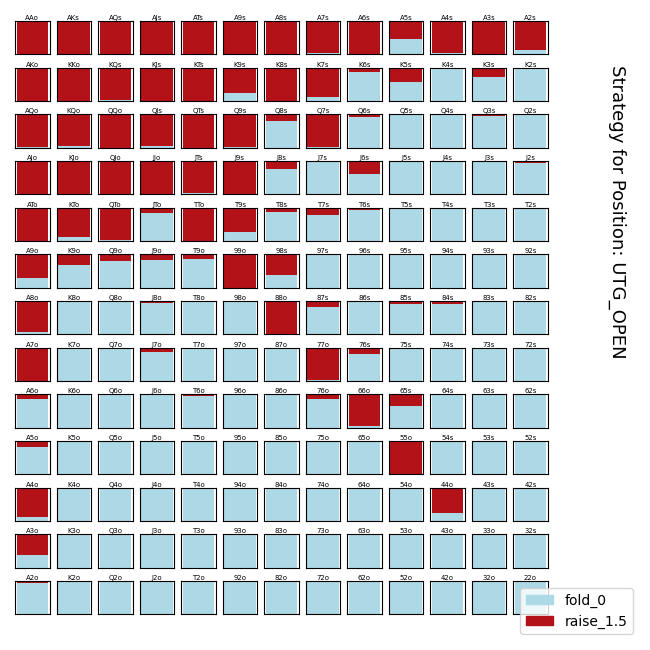
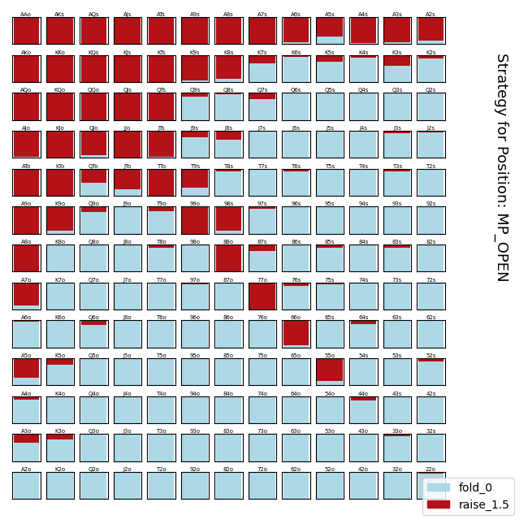
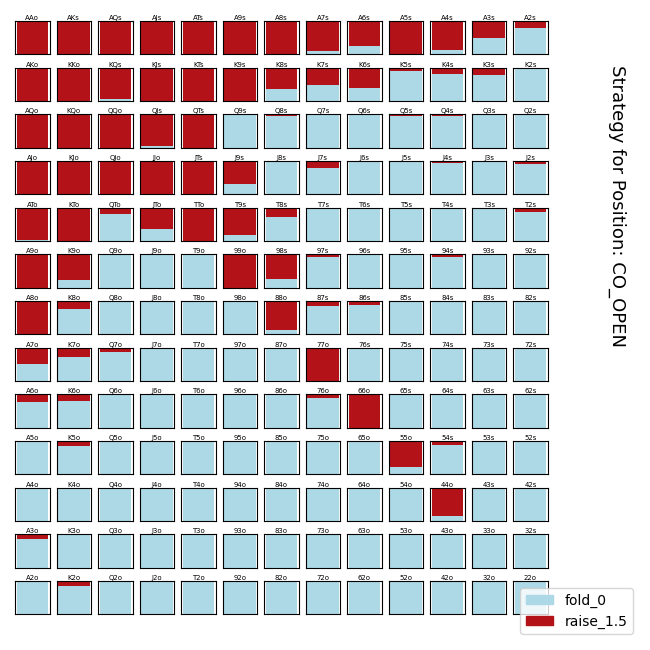
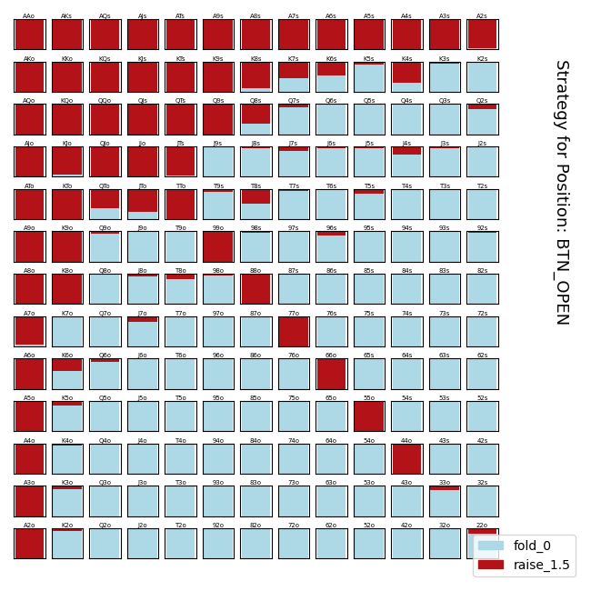
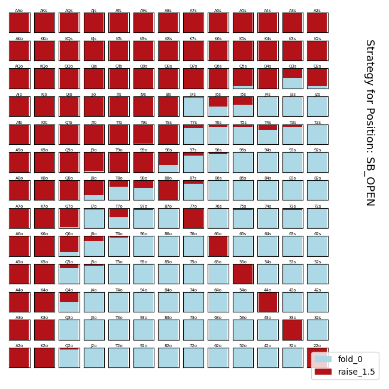

## Settings

```
    # FULL DECK
    SUITS = ['C', 'D', 'H', 'S']
    VALUES = [ '2', '3', '4', '5', '6', '7', '8', '9', 'T', 'J', 'Q', 'K', 'A']

    # 100 BB
    initial_chips = 1000
    small_blind = 5
    big_blind = 10

    # Number of showdown simulations
    num_showdown_simulations = 1

    # Number of passes over all positions in the blueprint strategy
    num_smoothing_iterations = 1

    # Number of training iterations for the CFR algorithm
    num_cfr_iterations = 2500
    # CFR tree search depth limit
    cfr_depth = 6


    # (TODO Not Implemented) Number of live-play iterations and depth.
    realtime_cfr_iterations = 200
    cfr_realtime_depth = 6
    
    # (TODO Test/Optimize) Depth at which to start Monte Carlo Simulation. 
    monte_carlo_depth = 9999
    # NOTE 
    # NOTE The game will automatically check/call to a terminal node if the CFR
    # NOTE depth is reached. Further, my implementation doesnt bring enough it-
    # NOTE erations to the monte carlo nodes resulting in random play. This is
    # NOTE something i plan to investigate.
    # NOTE 

    # Depth at which to start pruning regret and strategy sums.
    prune_depth = 4
    # NOTE 
    # NOTE This is the depth at which to stop saving regret and strategy sums.
    # NOTE These sums are the same ones required to construct the blueprint
    # NOTE strategy.
    # NOTE 


    # Chance-probability at which to start declaring a node "terminal"
    prune_probability = 1e-8

```

___










___

