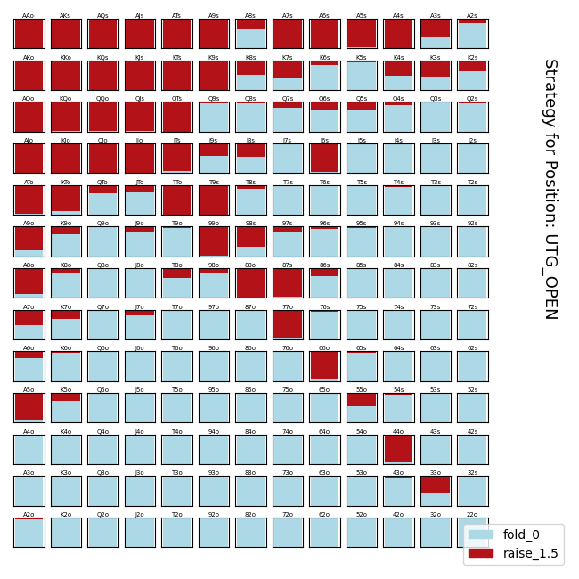
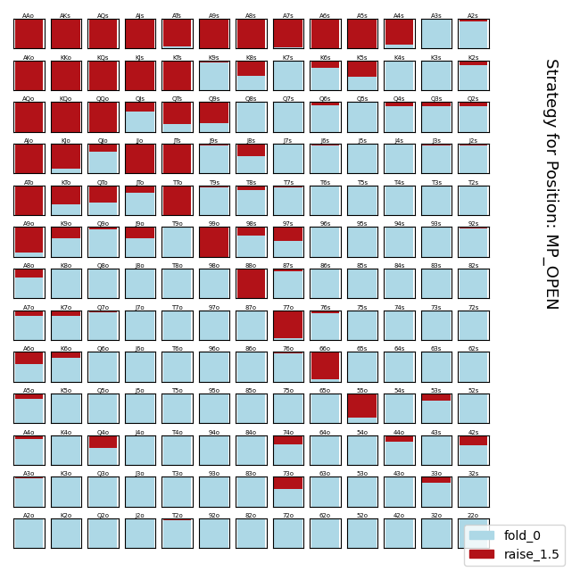
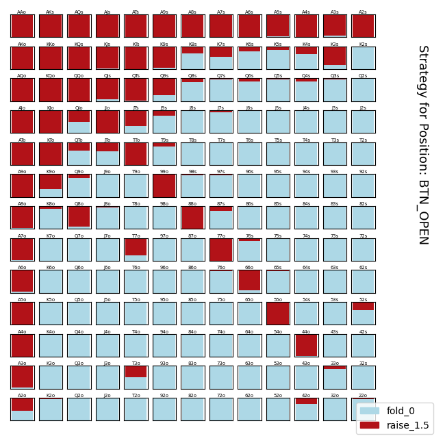
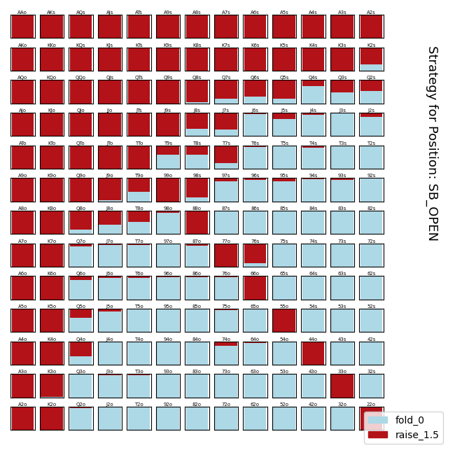

## Settings

```
    ## NO PRIOR PICKLES LOADED

    bet_sizing = [(1.5, 2.0,), (.5, 1,), (.40, .82, 1.2,), (.75, 1.2, 2,)]

    positions_to_solve, positions_dict = _6_max_opening()

    # set the deck (if you use a restricted deck, the evaluation will incorrectly evaluate against a full deck)
    SUITS = ['C', 'D', 'H', 'S']
    VALUES = [ '2', '3', '4', '5', '6', '7', '8', '9', 'T', 'J', 'Q', 'K', 'A']

    # 100 big blinds
    initial_chips = 1000
    small_blind = 5
    big_blind = 10

    # Pretty sure this is deprecated.. just leave it at 1.
    num_showdown_simulations = 1

    # Specify the number of times to iteratate over `positions_to_solve`.
    ## Fun Fact: This is one way to construct a blueprint strategy.
    num_smoothing_iterations = 1

    # **Number of iterations to run the CFR algorithm**
    num_cfr_iterations = 1000
    cfr_depth = 7
    
    # Depth at which to start Monte Carlo Simulation.
    monte_carlo_depth = 9999

    # Depth at which to start pruning regret and strategy sums.
    prune_depth = 5
    # Chance-probability at which to start declaring a node "terminal"
    prune_probability = 1e-10

```

___









___

